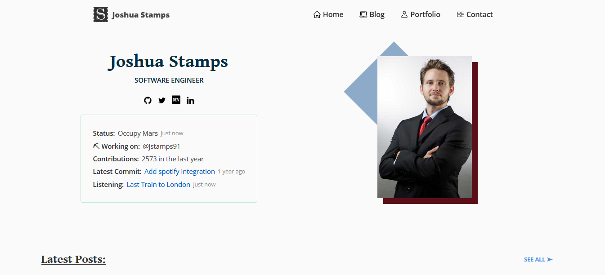

# Joshua Stamps Personal Website
<!-- [](https://circleci.com/gh/jstamps91/jstamps.com) -->
[](https://app.netlify.com/sites/jstamps91/deploys)
[](https://stackshare.io/jstamps-dev/stack)

Code of my personal static website were I write about Node, JS/Typescript, Java, Backend development and more.



Deployed at: https://jstamps.dev


## Commands

* `yarn create`.- Launch an interactive CLI to help to create a new blog post.

## 💪 Powered by:

* Built with [Gatsby](https://www.gatsbyjs.com/)
* Hosted in [Netlify](https://www.netlify.com/)

See complete stack in [StackShare](https://stackshare.io/jstamps-dev/stack)


## 💡 Features:
* [Blog](https://jstamps.dev/blog)
* [Portfolio](https://jstamps.dev/portfolio)
* [Dynamic status section](https://jstamps.dev/) supported via [my API](https://github.com/jstamps91/jstamps.dev-api):
  - Github Status
  - Contributions in last year
  - Latest commit
  - Listening
* [Tech Stack Section](https://jstamps.dev/#my-stack)
* Share Post buttons
* TypeScript support
* [Page for ech Tag](https://jstamps.dev/blog/tags/backend)
* Comments supported by [Disqus](https://disqus.com/)

## 🚀 Run

Install packages
```bash
yarn
```

And run:
```bash
yarn start
```

## 💱 Changelog


## ⚖️ License

[MIT](./LICENSE)
